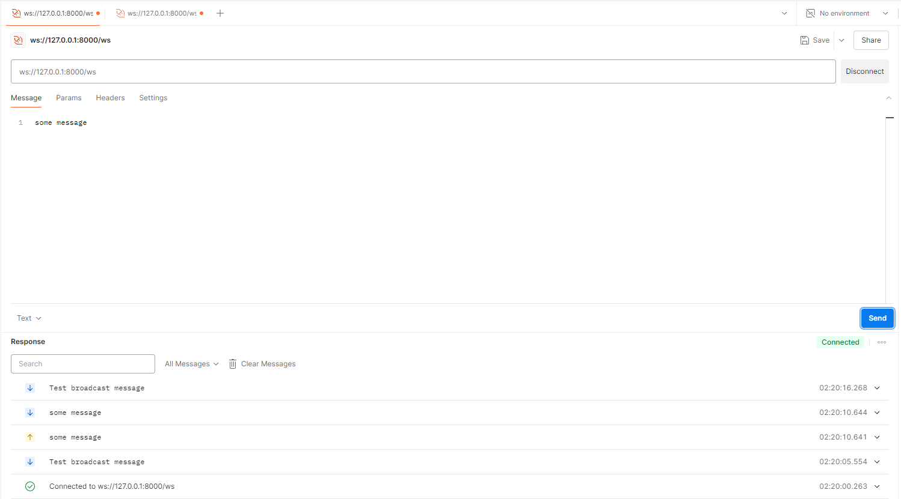
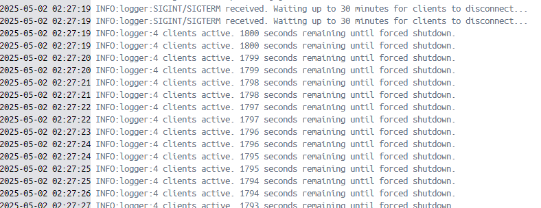

## Setup
1) Clone repo
`git clone https://github.com/pshkravets/fastapi_websockets.git`

2) Run docker container
`docker-compose up`
   
## Testin WebSocker endpoint

For testing we can use Postman:

1) Create and connect a few clients and try to send some message

2) Try to sent SIGINT/SIGTERM signal and check result: 

   
   
## Explanation of graceful shutdown logic 

On app startup created a task that handles SIGINT/SIGTERM signals and starts a timer for 1800 seconds(30 minutes) if 
any clients are connected. If no clients are connected or time expired it starts process of safe shutdown (executes all 
tasks and close redis connection). Also I've implemented a connected clients in redis so if we have any connection 
opened in any worker it won't stop our app before they disconnect. By default app runned on 2 workers, you can change
number of workers in dockerfile.